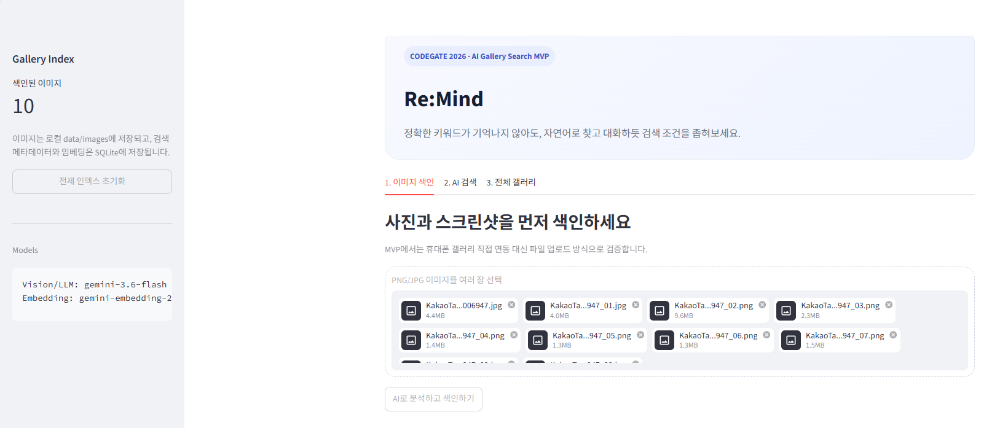

# 🔍 Re:Mind — AI Gallery Search



> **Personal Project · Work in Progress**

정확한 키워드가 기억나지 않아도 자연어와 대화를 통해 원하는 사진과 스크린샷을 찾을 수 있도록 개발 중인 **AI 기반 스마트 갤러리 검색 MVP**입니다.

사진 속 텍스트와 시각적 정보를 분석해 검색 가능한 데이터로 변환하고, **Keyword Search + Semantic Search + LLM Reranking**을 결합하여 검색 결과를 제공합니다.

---

## 💡 Problem

사진과 스크린샷이 쌓일수록 과거에 저장한 이미지를 다시 찾는 일이 어려워집니다.

파일명이나 정확한 키워드가 기억나지 않더라도,

> "예전에 저장했던 파스타 맛집"

처럼 기억의 일부만으로 검색하고,

> "여기서 직접 찍은 사진만 보여줘"

처럼 후속 조건을 추가해 결과를 좁혀갈 수 있는 검색 경험을 목표로 합니다.

---

## ✨ Core Features

### 1. AI Image Indexing

* 여러 장의 사진 및 스크린샷 업로드
* Gemini API를 활용한 이미지 분석
* OCR 텍스트, 이미지 설명, 태그, 이미지 유형 자동 추출
* 분석 결과와 Embedding을 SQLite에 저장

### 2. Hybrid Search

* OCR 및 태그 기반 **Keyword Search**
* Vector Embedding 기반 **Semantic Search**
* 두 검색 결과의 점수를 결합하여 후보 이미지 탐색

### 3. LLM Reranking

* Hybrid Search로 검색된 상위 후보를 LLM이 다시 검토
* 사용자 검색 의도에 적합한 순서로 결과 재정렬

### 4. Conversational Refine

최초 검색 이후 추가 조건을 입력하여 기존 결과를 다시 좁혀갈 수 있습니다.

```text
사용자: 파스타 맛집 사진 찾아줘

Re:Mind: 관련 이미지 검색

사용자: 여기서 직접 찍은 사진만 보여줘

Re:Mind: 이전 검색 맥락을 유지하여 결과 재검색
```

---

## 🏗 Architecture

```text
Gallery Images
      │
      ▼
Gemini Image Analysis
      │
      ├─ OCR Text
      ├─ Caption
      ├─ Tags
      └─ Image Type
      │
      ▼
Vector Embedding
      │
      ▼
SQLite
      │
      ▼
┌─────────────────────────┐
│      Hybrid Search      │
│                         │
│ Keyword + Semantic      │
└────────────┬────────────┘
             │
             ▼
       LLM Reranking
             │
             ▼
        Search Result
             │
             ▼
 Conversational Refine
```

---

## 🛠 Tech Stack

### Development

* Python
* Streamlit
* SQLite

### AI / Search

* Gemini API
* Vector Embedding
* Semantic Search
* Hybrid Search
* LLM Reranking

---

## 📁 Project Structure

```text
remind-ai-gallery-search/
├── app.py
├── search_engine.py
├── storage.py
├── services/
│   ├── __init__.py
│   └── gemini_service.py
├── data/
│   └── images/
├── .env.example
├── .gitignore
├── requirements.txt
└── README.md
```

---

## 🚀 Getting Started

### 1. Clone

```bash
git clone https://github.com/inha030902/remind-ai-gallery-search.git
cd remind-ai-gallery-search
```

### 2. Virtual Environment

Python 3.11 이상을 권장합니다.

```bash
python -m venv .venv
```

Windows:

```bash
.venv\Scripts\activate
```

macOS / Linux:

```bash
source .venv/bin/activate
```

### 3. Install Dependencies

```bash
pip install -r requirements.txt
```

### 4. Environment Variables

`.env.example`을 복사해 `.env` 파일을 생성합니다.

```env
GEMINI_API_KEY=YOUR_GEMINI_API_KEY
GEMINI_GENERATION_MODEL=gemini-3.6-flash
GEMINI_EMBEDDING_MODEL=gemini-embedding-2
```

> `.env` 파일은 Git에 포함되지 않습니다. API Key를 공개 저장소에 업로드하지 마세요.

### 5. Run

```bash
streamlit run app.py
```

---

## 🔎 How It Works

1. 사진 및 스크린샷 업로드
2. AI가 이미지의 시각 정보와 텍스트 분석
3. 검색용 메타데이터 및 Embedding 생성
4. 자연어 검색어 입력
5. Keyword + Semantic Search로 후보 탐색
6. LLM Reranking으로 결과 재정렬
7. 후속 조건을 입력해 검색 결과 구체화

---

## 🚧 Current Limitations

현재 버전은 서비스 출시가 아닌 **검색 경험과 기술적 구현 가능성을 검증하기 위한 MVP**입니다.

* 실제 모바일 갤러리 권한 연동 대신 웹 파일 업로드 방식 사용
* 이미지의 촬영 날짜 및 위치 기반 EXIF 검색 미구현
* 대규모 Vector DB 대신 SQLite와 NumPy 기반 유사도 계산 사용
* 인증 및 멀티유저 기능 미구현
* 이미지 유형과 질의에 따라 검색 정확도 차이가 존재

---

## 🗺 Next Steps

* Hybrid Search 가중치 및 검색 정확도 개선
* 이미지 분석/OCR 정확도 개선
* Conversational Refine UX 고도화
* 촬영 날짜 및 위치 기반 검색 지원
* 실제 모바일 갤러리 연동 방식 탐색
* 사용자 테스트를 통한 검색 시나리오 검증

---

## 📌 Status

현재 개인적으로 구현 가능성을 탐색하며 지속적으로 개발 중입니다.

특정 기술이나 구현 방식에 한정하기보다 **실제 검색 품질과 사용자 경험을 검증하면서 발전시키는 것**을 목표로 합니다.
